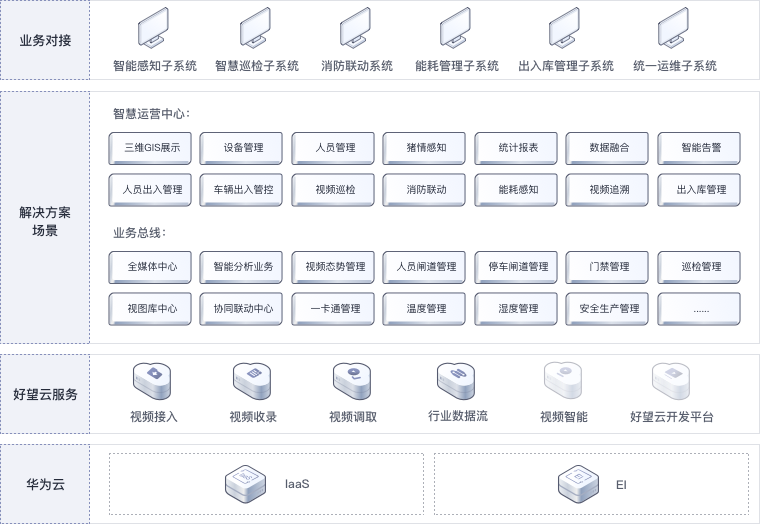

# 方案架构

## 架构特点

> 端边云协同，开放接入、智能生态、安全可信、统一体验

## 适用场景

> 适用于在养殖过程中对猪瘟疫情等疾病预防能力有限，生猪饲养成本高的养殖业，向数字化，智能化，无人化发展方向的转型

## 方案价值

- 猪场出入口视频全场景覆盖，智能识别，人/车进出人员信息记录；车辆识别/检索/设防，实现车辆高效管理

- 猪场周界精准检测，自动监测人员闯入行为，及时告警，确保猪场安全；猪场自动巡逻，一人看护多个巡点，高效管理

- 对猪舍出入口人员是否合理穿戴防护服、手套等行为进行分析；对猪舍内猪的行为进行识别分析；猪舍内温、湿等环境指标监测和智能控制；鼠、鸟、狗、猫四害识别

- 办公区域出入口内部人员快速识别通过，0.3秒内开闸，无停顿通行，黑名单设防，支持以图搜图，快速查找目标

- 好望开发平台为用户提供“开发-训练-部署-推理”全流程服务；支持算法定制，可一次训练适配不同规格的端边侧设备，大幅提升开发效率；自动优化算法模型，持续提升算法准确率

